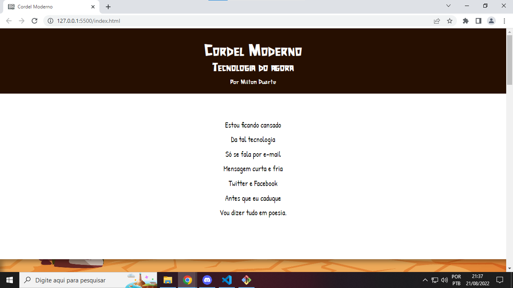
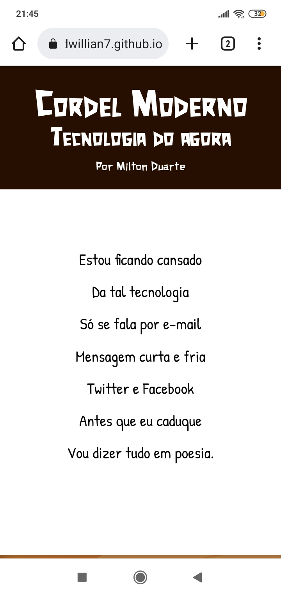
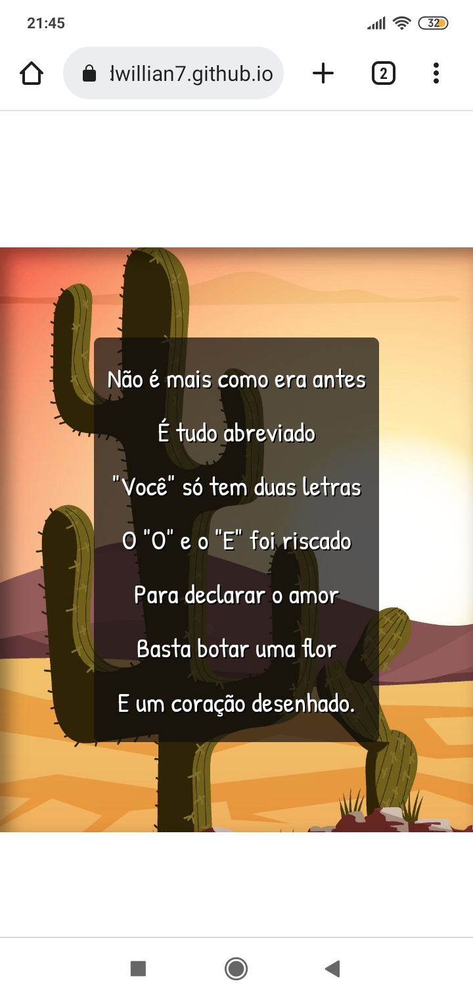

# Cordel-Moderno
O desafio é transformar a poesia do Milton Duarte em um site, incluindo efeitos parallax nas imagens aplicadas ao fundo da página.

### Responsividade:

## Feito Com:

Copyright © DavidWillian
